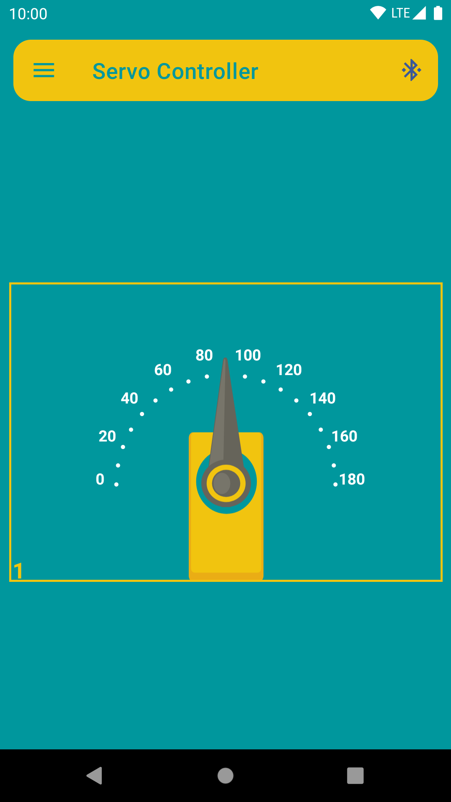
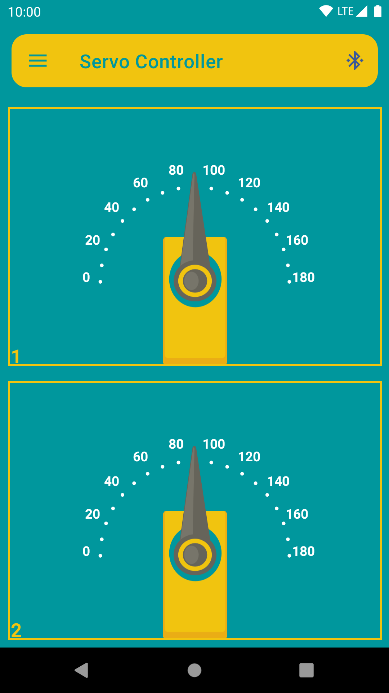
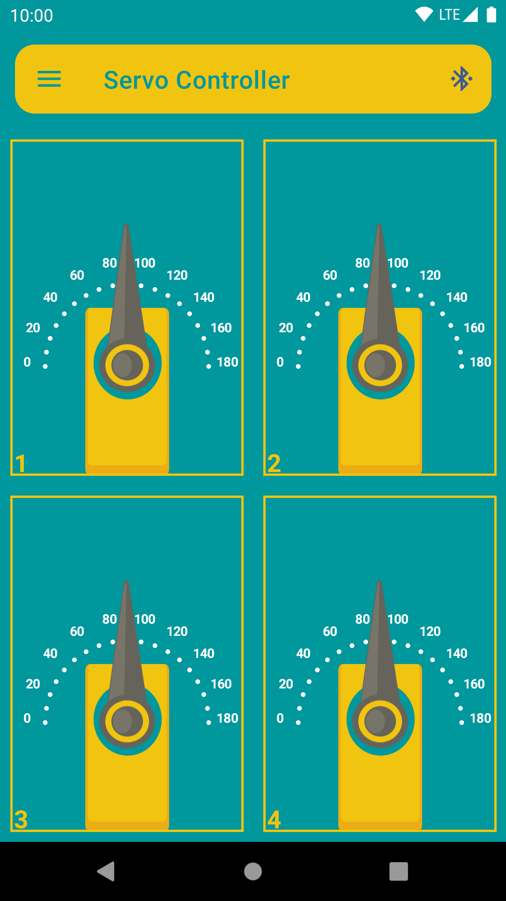
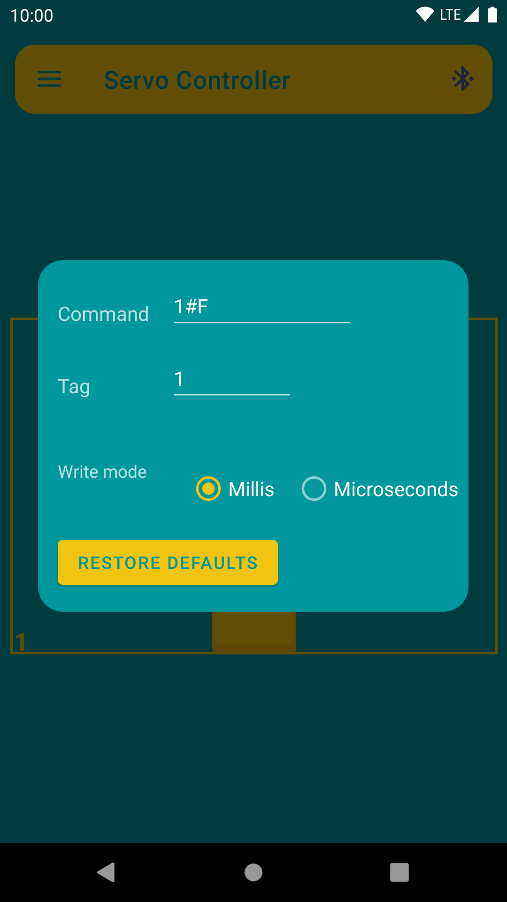

# Servo Controller

## Android Application for communicating with Arduino-compatible Bluetooth hardware and modules

### Description

Servo Controller allows you to send data over Bluetooth protocol to Arduino compatible Bluetooth modules(such as HC-06 or similar).
It has a cute simple servomotor texture to intuitively control rotation with your smartphone.

Features:

- Setup commands that will transfer to the Arduino.
- Tag each servo to differ them.
- Choose write mode(millis/microseconds).
- Simultaneously control up to 10 servos.
- Keep the phone screen awake on an active connection session.
- Change the servomotor texture view option for a better experience.

## Technologies and libraries

- [MVP](https://www.raywenderlich.com/7026-getting-started-with-mvp-model-view-presenter-on-android)
- [Coroutines](https://developer.android.com/kotlin/coroutines)
- [Navigation](https://developer.android.com/guide/navigation)
- [Material design](https://material.io/develop/android)
- [Preferences](https://developer.android.com/guide/topics/ui/settings)
- [HILT](https://developer.android.com/training/dependency-injection/hilt-android)
- [Room](https://developer.android.com/training/data-storage/room)
- [Lottie](https://github.com/airbnb/lottie-android)
- [ViewPager2](https://developer.android.com/jetpack/androidx/releases/viewpager2)
- [Timber](https://github.com/JakeWharton/timber)
- [Motion Layout](https://developer.android.com/training/constraint-layout/motionlayout)

## Testing section

- [Junit](https://developer.android.com/training/testing/unit-testing/local-unit-tests)
- [Truth](https://truth.dev)
- [Espresso](https://developer.android.com/training/testing/espresso)
- [Mockk](https://mockk.io)
- [AndroidX Test](https://developer.android.com/training/testing/set-up-project)
- [Fragment Testing](https://developer.android.com/training/basics/fragments/testing)
- [Leak canary](https://square.github.io/leakcanary/)

## Screenshots

## Download

